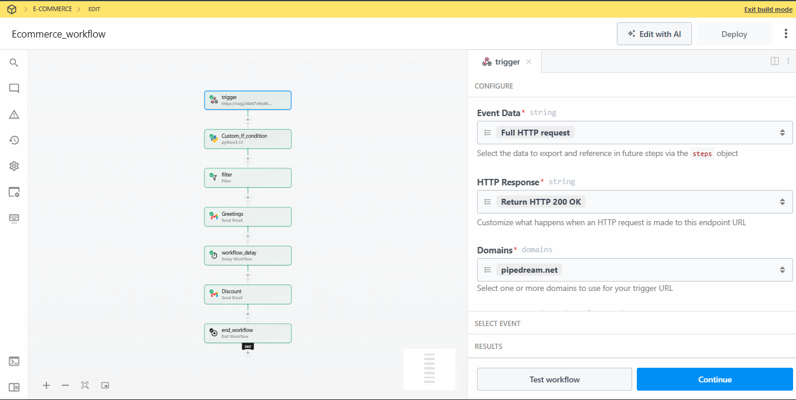
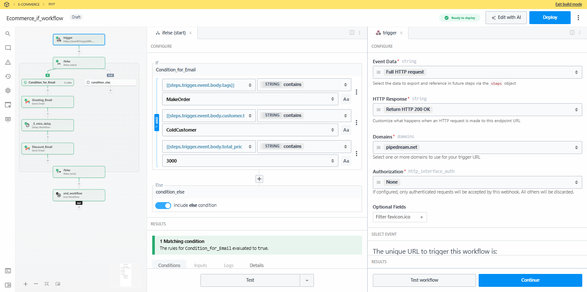
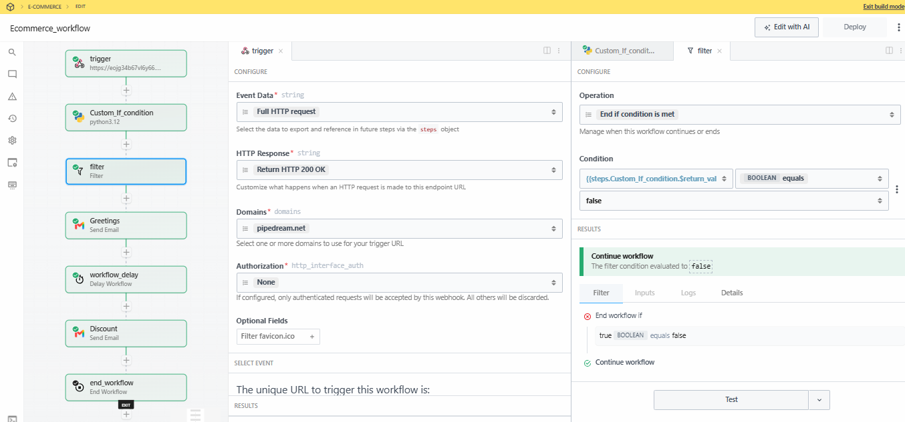
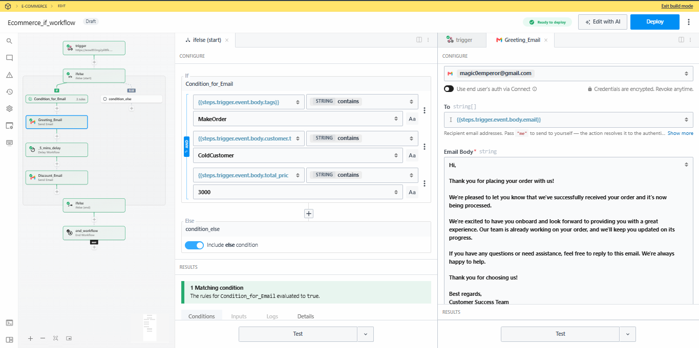
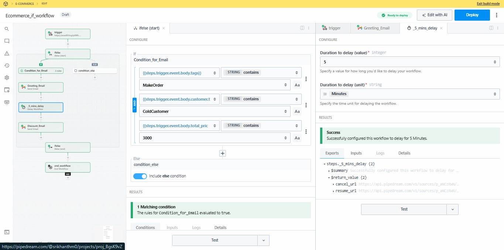

# Ecommerce Webhook Automation Assignment

<p align="center">
  
</p>

<p align="center">
  <strong>Forward Deployed Engineer Assignment</strong><br>
  HTTP Webhook • Workflow Automation • Conditional Logic • Gmail Integration
</p>

---

# personal Information

| Field                       | Details                     |
|-----------------------------|-----------------------------|
| **Name**                    | Srikhanth M                 |
| **Phone Number**            | +91-7200012857              |
| **Email**                   | [EMAIL_ADDRESS]             |
| **Role Applied**            | Forward Deployed Engineer   |
| **Platform Used**           | Pipedream                   |
| **Programming Language**    | Python 3.12                 |

---

# Assignment Overview

This assignment demonstrates the implementation of an automated ecommerce workflow using **Pipedream**. The workflow receives a Shopify Order Webhook, validates multiple business conditions, and automatically communicates with the customer using Gmail.

The automation performs the following actions:

- Receives an incoming Shopify Order Webhook
- Validates required business rules
- Sends an immediate onboarding email
- Waits for 5 minutes
- Sends a follow-up promotional email with a discount
- Terminates the workflow

---

# What is Pipedream?

Pipedream is a cloud-based workflow automation platform that enables developers to build integrations using APIs, serverless code, and visual workflows.

It provides:

- HTTP Webhooks
- API Integrations
- Workflow Automation
- Serverless Python / Node.js Execution
- Scheduling
- Email Integrations
- Data Processing

It is widely used for integrating SaaS applications without managing infrastructure.

---

# Assignment Requirements

The workflow validates the following conditions before sending emails.

| Validation   | Expected Value     |
|--------------|--------------------|
| Order Tag    | MakeOrder          |
| Customer Tag | ColdCustomer       |
| Order Amount | Greater than ₹2500 |

If all conditions are satisfied:

1. Send Welcome Email
2. Delay Workflow for 5 Minutes
3. Send Discount Email

Otherwise:

- Stop Workflow

---


Sharable & Deployment link:

https://pipedream.com/new?h=tch_QlfWrr (if flow workflow)

https://pipedream.com/new?h=tch_VdfezA (Custom Python Workflow)


# Workflow 1 (Native Pipedream If/Else)

## Workflow Architecture

```
HTTP Trigger
      │
      ▼
Advanced If / Else
      │
      ├── TRUE
      │      │
      │      ▼
      │  Gmail
      │      │
      │      ▼
      │  Delay (5 Minutes)
      │      │
      │      ▼
      │  Gmail
      │
      └── FALSE
             ▼
            End
```

---

## Configuration

### HTTP Trigger

- Method: POST
- Payload Type: JSON
- Response: HTTP 200 OK

---

### Conditions

| Field         | Operator    | Value          |
|---------------|-------------|----------------|
| tags          | contains    | MakeOrder      |
| customer.tags | contains    | ColdCustomer   |
| total_price   |     >       | 2500           |

---

### Gmail Configuration

Recipient

```
{{steps.trigger.event.body.email}}
```

Immediate Email

- Subject

```
Welcome! We've Received Your Order
```

Second Email

- Subject

```
Your Discount is Ready!
```

---

### Delay

```
5 Minutes
```

---

# Problem Encountered

While implementing the assignment, the native **Advanced If/Else** workflow component required a **paid Pipedream subscription** to deploy workflows.

Although the workflow was successfully created and tested locally within the editor, deployment of workflows containing the Advanced If/Else component was restricted under the current free workspace.

Since the assignment requested a complete working solution, I additionally implemented the same business logic using a **custom Python workflow**, ensuring identical functionality while remaining compatible with the available workspace features.


---

# Workflow 2 (Custom Python Implementation)

## Workflow Architecture

```
HTTP Trigger
      │
      ▼
Python Condition Validator
      │
      ▼
Filter
      │
      ▼
Gmail
      │
      ▼
Delay (5 Minutes)
      │
      ▼
Gmail
      │
      ▼
End Workflow
```

---

# Python Condition Validation

```python
def handler(pd: "pipedream"):
    body = pd.steps["trigger"]["event"]["body"]

    order_tags = body.get("tags", "")
    customer_tags = body.get("customer", {}).get("tags", "")
    total_price = float(body.get("total_price", 0))

    qualified = (
        "MakeOrder" in order_tags
        and "ColdCustomer" in customer_tags
        and total_price > 2500
    )

    return {
        "qualified": qualified,
        "email": body.get("email")
    }
```

---

# Filter Configuration

The filter continues execution only when:

```
qualified == true
```

Otherwise, the workflow terminates.

---

# Workflow Execution

```
Receive Webhook
        │
        ▼
Read JSON Payload
        │
        ▼
Validate Conditions
        │
        ├── False
        │      ▼
        │    Stop Workflow
        │
        └── True
               │
               ▼
        Send Welcome Email
               │
               ▼
         Wait 5 Minutes
               │
               ▼
        Send Discount Email
               │
               ▼
          End Workflow
```

---

# Sample Webhook Payload

```json
{
    "tags": "MakeOrder",
    "customer": {
        "tags": "ColdCustomer"
    },
    "total_price": "3000.00",
    "email": "customer@example.com"
}
```

---

# Technologies Used

- Pipedream
- Python 3.12
- HTTP Webhooks
- Gmail Integration
- Workflow Automation
- JSON
- Shopify Webhook Payload

---

# Testing

The workflow was tested using manually generated webhook requests.

## Test Case 1

Input

- Order Tag = MakeOrder
- Customer Tag = ColdCustomer
- Order Amount = 3000

Expected

Welcome Email

Delay 5 Minutes

Discount Email

Result

Passed

---

## Test Case 2

Input

Order Amount = 1500

Expected

No emails sent

Result

 Passed

---

# Screenshots

## Workflow 1

[](Workflow_ScreenShot/if_flow_workflow.png)

---

## Workflow 2

[](Workflow_ScreenShot/Custom_if_workflow.png)

---

## HTTP Trigger

[](Workflow_ScreenShot/Trigger.png)

---

## Python Step

[](Workflow_ScreenShot/custom_flow_workflow.png)

---

## Filter Configuration

[](Workflow_ScreenShot/Filter_workflow.png)

---

## Gmail Configuration

[](Workflow_ScreenShot/Gmail_workflow.png)

---

## Delay Configuration

[](Workflow_ScreenShot/Delay_workflow.png)

---
## Discount Gmail Configuration

[](Workflow_ScreenShot/Discount_Gmail_workflow.png)

# Repository Structure

```
.
├── README.md
├── python
│   └── custom_if_condition.py
├── screenshots
│   ├── workflow_1.png
│   ├── workflow_2.png
│   ├── trigger.png
│   ├── python.png
│   ├── filter.png
│   ├── gmail.png
│   ├── delay.png
```

---

# Conclusion

This assignment demonstrates an automated ecommerce order-processing workflow built using Pipedream. The solution validates incoming Shopify webhook data, executes conditional business logic, and automates customer communication through Gmail.

To ensure compatibility with the available workspace limitations, both a native Pipedream workflow and an equivalent Python-based implementation have been documented. The Python workflow preserves identical business functionality while avoiding deployment restrictions associated with premium workflow control components.

